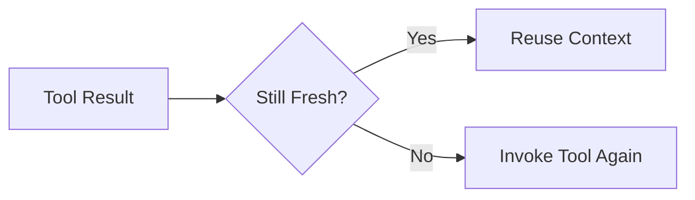
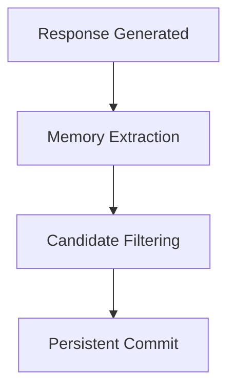

# Known Fragilities

This document tracks architectural areas that are currently stable enough for operation but still sensitive to regression, semantic drift, or future redesign pressure.

A fragility is not necessarily a bug.

It is a runtime boundary where behavior depends on constraints that must remain explicit.

---

# Fragility Classification

Current fragilities are grouped by:

- execution sensitivity
- semantic coupling
- future architectural pressure

---

# 1. Executor Step Interpretation Boundary

The executor currently depends on strict interpretation of the active step before deciding whether to:

- execute a tool
- continue conversationally
- finalize execution

This boundary remains sensitive because semantic ambiguity in a step may produce unintended branching.

## Current Stable Constraint

Only the active step is interpreted.

The executor must not infer hidden future intent.

## Sensitive Area

If step wording becomes too broad, tool selection may degrade.

## Runtime Shape

```mermaid
flowchart TD
    A[Pending Step] --> B{Interpret Step}
    B -->|Tool Required| C[Tool Invocation]
    B -->|Direct Response| D[LLM Response]
    C --> E[Executor Resume]
    D --> E
````

## Current Protection

* explicit step consumption
* bounded tool execution
* no implicit replanning

## Residual Risk

A planner output with weak semantic precision may still increase executor ambiguity.

---

# 2. Planner-to-Executor Semantic Coupling

Planner output remains intentionally lightweight, but this creates dependency on executor interpretation quality.

## Current Stable Constraint

Planner should describe intent clearly enough for executor consumption.

## Sensitive Area

Overly compressed planning language may under-specify execution.

## Example Pressure

Weak:

```text
check and continue
```

Stable:

```text
query current time using tool
```

## Residual Risk

Planner compactness and executor determinism remain in tension.

---

# 3. Tool Freshness Semantics

Tool usage currently depends on freshness assumptions within the active turn.

This is stable for current scope, but still sensitive when:

* repeated tool opportunities appear
* previous tool outputs partially satisfy later steps

## Runtime Shape



## Current Protection

* active-turn freshness preference
* explicit tool boundary
* executor step-by-step progression

## Residual Risk

Future multi-tool skills may require stronger freshness identity tracking.

---

# 4. Memory Extraction Separation

Memory extraction is correctly isolated after response generation.

This is stable architecturally, but sensitive if future phases expand memory authority.

## Current Stable Constraint

Memory never alters current turn execution.

## Runtime Shape



## Residual Risk

If memory gains stronger retrieval authority, execution boundaries must remain protected.

---

# 5. Skill Boundary Definition (Phase Transition Pressure)

The skill layer is emerging but not yet fully normalized.

This creates temporary fragility because multiple behaviors may still exist partly inside executor logic.

## Current Stable Constraint

Skills remain subordinate to executor authority.

## Sensitive Area

A skill must not silently become an autonomous planner.

## Residual Risk

Without strict contracts, skills may duplicate planner responsibility.

---

# 6. Documentation Drift Risk

Architecture is evolving phase by phase.

There is active risk that:

* runtime behavior changes
* documentation lags behind
* assumptions become stale

## Current Protection

Required synchronization between:

* `docs/ARCHITECTURE.md`
* `docs/PHASES.md`
* ADR records

---

# What Is Not Considered Fragile

The following areas are currently considered structurally stable:

* explicit pending plan existence
* step consumption model
* tool isolation boundary
* post-response memory extraction

---

# Maintenance Rule

A fragility should remain listed until one of two things happens:

## It becomes structurally solved

or

## It becomes a deliberate architectural choice

Until then, fragilities must stay visible.
